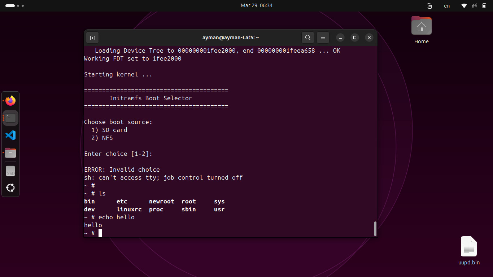

# Lab 07: Create Your Own Initramfs and Reach a Working Shell

## 🎯 Lab Overview

This lab guides you through building a complete, working initramfs (initial RAM filesystem) from scratch to eliminate the famous "Kernel panic - not syncing: No working init found" error.

**Target Platform:** Raspberry Pi 3B+ (via serial console)



---

## 📚 Understanding Check - Questions & Answers

### 1. What is initramfs? Why use it instead of mounting the real rootfs directly?

**initramfs** = **Init**ial **RAM** **F**ile**s**ystem

It's a temporary root filesystem loaded into RAM during the boot process.

**Why use it instead of mounting rootfs directly?**

| Reason | Explanation |
|--------|-------------|
| **Drivers not ready** | Kernel may need to load modules to read the disk |
| **Flexibility** | Can perform setup or checks before starting the real system |
| **Security** | Can decrypt the rootfs first |
| **Simplicity** | For embedded systems, it can be the only rootfs |

```
Without initramfs:
┌──────────┐     ┌─────────────┐
│  Kernel  │ ──▶ │  ????????   │ ──▶ Kernel Panic!
└──────────┘     │ No rootfs   │
                 └─────────────┘

With initramfs:
┌──────────┐     ┌─────────────┐     ┌──────────┐
│  Kernel  │ ──▶ │  initramfs  │ ──▶ │  Shell   │ ✓
└──────────┘     │  (in RAM)   │     │  / #     │
                 └─────────────┘     └──────────┘
```

---

### 2. Why cpio format for initramfs? Why not tar or zip?

The Kernel understands **cpio** format directly without needing external programs.

| Format | Kernel understands it? | Needs external program? |
|--------|------------------------|-------------------------|
| **cpio** | ✅ Yes | ❌ No |
| tar | ❌ No | ✅ Yes (needs tar) |
| zip | ❌ No | ✅ Yes (needs unzip) |

**The chicken-and-egg problem with tar/zip:**
```
Kernel: I want to extract the rootfs
        But I need the tar program
        But tar is inside the rootfs
        But I can't open rootfs without tar
        💀 Kernel Panic!
```

**cpio is simpler:**
- Just a list of files one after another
- Kernel can read it easily
- No complex parser needed

---

### 3. What does rdinit= do? What happens if wrong path?

**`rdinit=`** tells the kernel which program to run first from the initramfs.

**Example:**
```bash
rdinit=/sbin/init
```
Means: "Kernel, run `/sbin/init` as the first program"

**If not specified, kernel searches in order:**
1. /sbin/init
2. /etc/init
3. /bin/init
4. /bin/sh

**If wrong path:**
```
Kernel panic - not syncing: Requested init /sbin/wrong_path failed (error -2)
```
Error `-2` means "File not found" (ENOENT)

**Difference between `rdinit=` and `init=`:**

| Parameter | Used with |
|-----------|-----------|
| `rdinit=` | initramfs (in RAM) |
| `init=` | Real rootfs (on disk) |

---

### 4. Why must init be statically linked? What if dynamic?

**Static linking:** The program contains everything it needs inside itself.

**Dynamic linking:** The program needs external libraries to run.

```
Static Linked:
┌─────────────────────────┐
│         busybox         │
│  ┌───────────────────┐  │
│  │ All libraries     │  │
│  │ inside program    │  │
│  └───────────────────┘  │
└─────────────────────────┘
     ✅ Works alone


Dynamic Linked:
┌──────────┐
│  busybox │ ──▶ Needs /lib/libc.so
└──────────┘ ──▶ Needs /lib/ld-linux.so
                 ──▶ Needs other files...
     
     ❌ Won't work without libraries
```

**Problem with dynamic in initramfs:**

The initramfs is **very small** and doesn't have libraries.

```
Kernel: I'll run /sbin/init
init:   I need /lib/libc.so.6
Kernel: Can't find it!
        💀 Kernel Panic!
```

**How to check if static or dynamic:**
```bash
file /bin/busybox
# Static: "statically linked"
# Dynamic: "dynamically linked, interpreter /lib64/ld-linux..."

ldd /bin/busybox
# Static: "not a dynamic executable"
# Dynamic: Shows list of required libraries
```

---

### 5. Difference: initramfs vs initrd?

Both serve the same purpose but implementation differs.

**initrd (old method):**
- Real disk image (like ext2 image)
- Kernel treats it as a virtual hard disk
- Needs driver to read it
- Stays in fixed RAM location

**initramfs (new method):**
- Just a cpio archive
- Kernel extracts directly into RAM
- No driver needed
- Memory can be freed later

```
initrd (old):
┌─────────────────────────────────────┐
│              RAM                    │
│  ┌─────────────────────────────┐    │
│  │    ext2 disk image          │    │
│  │  ┌───────┐ ┌───────┐        │    │
│  │  │ /bin  │ │ /sbin │  ...   │    │
│  │  └───────┘ └───────┘        │    │
│  └─────────────────────────────┘    │
│         ▲                           │
│    Kernel reads as disk             │
│    (needs driver)                   │
└─────────────────────────────────────┘


initramfs (new):
┌─────────────────────────────────────┐
│              RAM                    │
│                                     │
│    /bin ──▶ Files directly in RAM   │
│    /sbin ──▶ Files directly in RAM  │
│    /init ──▶ Files directly in RAM  │
│                                     │
│    Kernel reads directly            │
│    (no driver needed)               │
└─────────────────────────────────────┘
```

| Feature | initrd | initramfs |
|---------|--------|-----------|
| Format | disk image (ext2) | cpio archive |
| Needs driver? | ✅ Yes | ❌ No |
| Flexibility | Less | More |
| Size | Larger | Smaller |
| Memory release | Hard | Easy |
| Used today? | ❌ Old | ✅ Current method |

---

### 6. Where is initramfs loaded in memory? Who decompresses it?

**Boot Process:**

```
┌─────────────┐
│   U-Boot    │
└──────┬──────┘
       │
       ▼
   1. Loads Kernel into RAM
   2. Loads DTB into RAM  
   3. Loads initramfs.cpio.gz into RAM
       │
       ▼
┌─────────────┐
│   Kernel    │
└──────┬──────┘
       │
       ▼
   4. Decompresses initramfs
   5. Puts it in ramfs/tmpfs
   6. Runs /sbin/init
       │
       ▼
┌─────────────┐
│   Shell     │
│    / #      │
└─────────────┘
```

**U-Boot loads files at specific addresses:**
```bash
tftp 0x2000000 Image           # Kernel
tftp 0x4000000 bcm2837.dtb     # Device Tree
tftp 0x5000000 rootfs.cpio.gz  # initramfs
```

**Who does what:**

| Stage | Responsible |
|-------|-------------|
| Loading file into RAM | **U-Boot** (or any bootloader) |
| Decompression | **Kernel itself** |
| Placing in tmpfs | **Kernel itself** |
| Running init | **Kernel itself** |

**Kernel understands multiple compression types:**
```
rootfs.cpio       # No compression
rootfs.cpio.gz    # gzip compressed
rootfs.cpio.xz    # xz compressed
rootfs.cpio.bz2   # bzip2 compressed
```

---

### 7. How does kernel switch from initramfs to real rootfs?

The initramfs is a **temporary stage**. After finishing its job, it switches to the real rootfs.

```
┌─────────────────────────────────────────────────────────┐
│                                                         │
│  1. Kernel runs /init from initramfs                    │
│                    │                                    │
│                    ▼                                    │
│  2. /init loads required drivers                        │
│                    │                                    │
│                    ▼                                    │
│  3. /init mounts real rootfs                            │
│     mount /dev/sda1 /mnt/root                           │
│                    │                                    │
│                    ▼                                    │
│  4. /init does switch_root                              │
│     exec switch_root /mnt/root /sbin/init               │
│                    │                                    │
│                    ▼                                    │
│  5. Kernel deletes initramfs from RAM                   │
│     and continues from real rootfs                      │
│                                                         │
└─────────────────────────────────────────────────────────┘
```

**The magic command: switch_root**
```bash
exec switch_root /mnt/root /sbin/init
```

| Part | Meaning |
|------|---------|
| `exec` | Replace current program (don't return) |
| `switch_root` | Command that does the transition |
| `/mnt/root` | New rootfs |
| `/sbin/init` | First program to run in new rootfs |

**Note:** In this lab, we don't use switch_root because the initramfs IS our final rootfs.

---

## 🛠️ Practical Implementation

### Step 1: Create Directory Structure

```bash
cd ~
mkdir -p initramfs
cd initramfs
mkdir -p bin sbin dev proc sys etc etc/init.d tmp
```

### Step 2: Build BusyBox (Static)

```bash
cd ~/busybox
make distclean
make ARCH=arm64 CROSS_COMPILE=~/x-tools/aarch64-rpi3-linux-gnu/bin/aarch64-rpi3-linux-gnu- defconfig
make ARCH=arm64 CROSS_COMPILE=~/x-tools/aarch64-rpi3-linux-gnu/bin/aarch64-rpi3-linux-gnu- menuconfig
```

**In menuconfig:**
- ✅ Enable: `Settings → Build static binary (no shared libs)`
- ❌ Disable: `Settings → SHA-NI accelerated SHA1`
- ❌ Disable: `Networking Utilities → tc`

```bash
make ARCH=arm64 CROSS_COMPILE=~/x-tools/aarch64-rpi3-linux-gnu/bin/aarch64-rpi3-linux-gnu- -j$(nproc)
```

**Verify it's static:**
```bash
file busybox
# Should show: "statically linked"
```

### Step 3: Install BusyBox and Create Links

```bash
cp ~/busybox/busybox ~/initramfs/bin/

cd ~/initramfs/bin
ln -s busybox sh
ln -s busybox ls
ln -s busybox echo
ln -s busybox cat
ln -s busybox mount

cd ~/initramfs/sbin
ln -s ../bin/busybox init
```

### Step 4: Create Device Files

```bash
cd ~/initramfs/dev
sudo mknod -m 666 console c 5 1
sudo mknod -m 666 null c 1 3
sudo mknod -m 666 tty c 5 0
```

### Step 5: Create inittab

```bash
cat > ~/initramfs/etc/inittab << 'EOF'
::sysinit:mount -t devtmpfs dev /dev
::sysinit:mount -t proc proc /proc
::sysinit:mount -t sysfs sys /sys
::sysinit:mount -t tmpfs tmp /tmp

# run startup script
::sysinit:/etc/init.d/rcS

console::respawn:/bin/sh

::shutdown:/bin/umount -a -r
EOF
```

### Step 6: Create Startup Script

```bash
cat > ~/initramfs/etc/init.d/rcS << 'EOF'
#!/bin/sh
echo "================================"
echo "Welcome to Ayman's initramfs!"
echo "System is starting..."
echo "================================"
EOF

chmod +x ~/initramfs/etc/init.d/rcS
```

### Step 7: Create cpio Archive

```bash
cd ~/initramfs
sudo find . | sudo cpio -o -H newc | gzip > ~/rootfs.cpio.gz
```

### Step 8: Convert to U-Boot Format (Optional but Recommended)

```bash
mkimage -A arm64 -T ramdisk -C gzip -n "initramfs" -d ~/rootfs.cpio.gz ~/rootfs.uImage
```

### Step 9: Copy to TFTP Server

```bash
sudo cp ~/rootfs.cpio.gz /srv/tftp/
# OR if using uImage:
sudo cp ~/rootfs.uImage /srv/tftp/
```

---

## ⚙️ U-Boot Configuration

### Environment Variables

```bash
setenv serverip 192.168.2.1
setenv ipaddr 192.168.2.2

setenv loadker "tftp 0x2000000 Image"
setenv loadfdt "tftp 0x4000000 bcm2837-rpi-3-b-plus.dtb"
setenv loadinitfs "tftp 0x5000000 rootfs.uImage"

setenv bootargs "earlycon=bcm2835aux,0x3f215040 console=ttyS1,115200 8250.nr_uarts=1 keep_bootcon loglevel=0 rdinit=/sbin/init"

setenv bootcmd "run loadker; run loadfdt; run loadinitfs; booti 0x2000000 0x5000000 0x4000000"

saveenv
```

### ⚠️ Important: Reduce Kernel Logs

To hide the noisy kernel messages, set `loglevel=0` in bootargs:

```bash
# Change loglevel from 8 to 0
setenv bootargs "... loglevel=0 ..."

# Or use sed in boot.cmd file:
sed -i 's/loglevel=8/loglevel=0/g' /media/ayman/bootfs/boot.cmd
```

| loglevel | Messages shown |
|----------|----------------|
| 0 | Emergency only |
| 1 | Alerts |
| 3 | Errors |
| 7 | Debug |
| 8 | All messages |

---

## 🚀 Boot Process

```bash
run bootcmd
```

**Expected Output:**
```
Starting kernel ...

================================
Welcome to Ayman's initramfs!
System is starting...
================================

/ # ls
bin  dev  etc  proc  sbin  sys  tmp

/ # echo "Hello from Ayman"
Hello from Ayman
```

---

## 📁 Final Directory Structure

```
initramfs/
├── bin/
│   ├── busybox
│   ├── sh -> busybox
│   ├── ls -> busybox
│   ├── echo -> busybox
│   ├── cat -> busybox
│   └── mount -> busybox
├── sbin/
│   └── init -> ../bin/busybox
├── dev/
│   ├── console
│   ├── null
│   └── tty
├── etc/
│   ├── inittab
│   └── init.d/
│       └── rcS
├── proc/
├── sys/
└── tmp/
```

---

## 🔧 Troubleshooting

### Problem: "Kernel panic - not syncing: No working init found"
**Solution:** Ensure `/sbin/init` exists and is a valid symlink to busybox.

### Problem: "Attempted to kill init! exitcode=0x00007f00"
**Solution:** BusyBox is dynamically linked. Rebuild with static linking enabled.

### Problem: "Exec format error"
**Solution:** BusyBox compiled for wrong architecture. Use correct cross-compiler.

### Problem: "can't open /dev/tty2: No such file or directory"
**Solution:** Add device files to `/dev/` or use `rdinit=/bin/sh` instead of init.

### Problem: Too many kernel messages
**Solution:** Add `quiet` to bootargs or set `loglevel=0`.

### Problem: Ramdisk size is 0
**Solution:** Use uImage format with mkimage, or pass correct filesize to booti.

---

## ✅ Checklist

- [x] Created initramfs directory structure
- [x] Built BusyBox with static linking
- [x] Created symbolic links for commands
- [x] Added device files (console, null, tty)
- [x] Created /etc/inittab
- [x] Created /etc/init.d/rcS startup script
- [x] Generated cpio archive
- [x] Converted to uImage format (optional)
- [x] Configured U-Boot environment
- [x] Set loglevel=0 to reduce noise
- [x] Successfully booted to shell
- [x] Tested ls command
- [x] Tested echo command

---

## 📖 References

- [Kernel Documentation: ramfs-rootfs-initramfs](https://www.kernel.org/doc/Documentation/filesystems/ramfs-rootfs-initramfs.txt)
- [BusyBox Documentation](https://busybox.net/downloads/BusyBox.html)
- [U-Boot Documentation](https://u-boot.readthedocs.io/)

---

**Author:** Ayman  
**Date:** March 2024  
**Lab:** Embedded Linux - Lab 07
```
