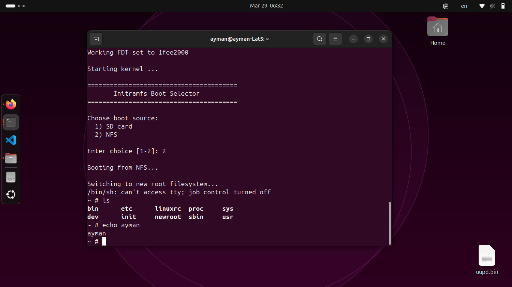
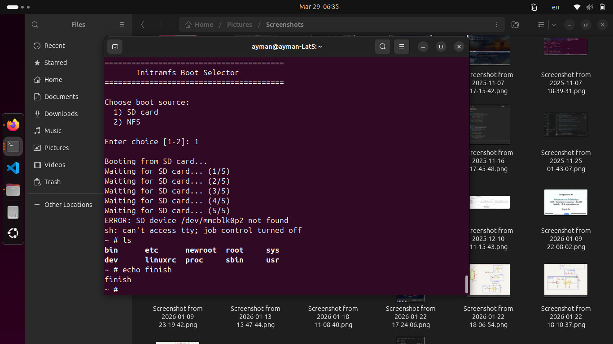

# Initramfs-Based Root Filesystem Selection

**Raspberry Pi 3B+ | BusyBox | U-Boot | NFS**







---

## 1. Overview

This project implements an initramfs-based boot selector for the Raspberry Pi 3B+. Instead of booting directly into a fixed root filesystem, the initramfs acts as the first user-space environment after the kernel boots. It presents the user with a menu to select between two root filesystem sources: an SD card partition or an NFS-mounted filesystem over the network.

---

## 2. Assignment Questions & Answers

### Q1: What is initramfs and why is it used here?

Initramfs (Initial RAM Filesystem) is a temporary root filesystem loaded into RAM by the kernel during the early boot stage. It runs before any permanent root filesystem is mounted.

In this project, it is used because:
- It allows custom logic to run before the final root filesystem is selected.
- It can initialize hardware, mount virtual filesystems, and detect devices.
- It provides a controlled environment to prompt the user for boot selection.
- It is entirely RAM-based, so it works even if the SD card has issues.

---

### Q2: What is the role of `/sbin/init` in the initramfs?

`/sbin/init` is the first process executed by the Linux kernel after it decompresses and mounts the initramfs. It runs as **PID 1**.

In this project, `/sbin/init` is a shell script that calls `/etc/init.d/rcS`, which contains the actual boot selection logic. The kernel is told to use this init via the kernel parameter:

```
rdinit=/sbin/init
```

---

### Q3: What does the rcS script do step by step?

The rcS script performs the following steps in order:

1. Sets the `PATH` environment variable for BusyBox commands.
2. Creates required directories: `/proc`, `/sys`, `/dev`, `/newroot`.
3. Mounts virtual filesystems: `proc`, `sysfs`, and `devtmpfs`.
4. Runs `mdev -s` to populate `/dev` with device nodes.
5. Redirects console I/O so the user can interact via the serial terminal.
6. Waits 5 seconds for the system to stabilize.
7. Displays the boot selection menu.
8. Reads the user's choice (1 for SD card, 2 for NFS).
9. Waits for the selected device to become available.
10. Mounts the selected root filesystem to `/newroot`.
11. Verifies that `/sbin/init` exists in the new root.
12. Mounts `proc`, `sysfs`, and `devtmpfs` inside `/newroot`.
13. Executes `exec chroot /newroot /sbin/init` to switch root.

---

### Q4: What is the dual partition structure on the SD card?

The SD card is partitioned into two main partitions:

| Partition | Type | Size | Contents | Role |
|-----------|------|------|----------|------|
| `/dev/mmcblk0p1` | FAT16 (bootfs) | 200 MB | u-boot.bin, Image, DTB, uInitramfs, boot.scr | Loaded by U-Boot |
| `/dev/mmcblk0p2` | Linux ext4 (rootfs) | ~29 GB | BusyBox root filesystem | Final root (option 1) |

Partition 1 is read by U-Boot to load the kernel, device tree, and initramfs. Partition 2 is the actual Linux root filesystem that the system boots into when the user selects SD card boot.

---

### Q5: How does U-Boot load and boot the initramfs?

U-Boot executes a boot script (`boot.scr`) stored on the bootfs partition. The script:

1. Configures the network interface with a static IP address.
2. Downloads the kernel `Image` from the TFTP server.
3. Downloads the Device Tree Blob (DTB) from the TFTP server.
4. Downloads the `uInitramfs` image from the TFTP server.
5. Calls `booti` to boot the kernel with the initramfs and DTB.

The relevant U-Boot boot command is:

```
booti ${kernel_addr_r} ${initramfs_addr_r} ${fdt_addr_r}
```

---

### Q6: What kernel parameters are passed to the kernel?

The following `bootargs` are passed by U-Boot to the kernel when using initramfs:

```
console=ttyS1,115200 8250.nr_uarts=1 loglevel=0 panic=5 rdinit=/sbin/init
```

| Parameter | Meaning |
|-----------|---------|
| `console=ttyS1,115200` | Serial console output at 115200 baud |
| `8250.nr_uarts=1` | Limit UART count for RPi3B+ |
| `loglevel=0` | Suppress kernel log messages during boot |
| `panic=5` | Reboot after 5 seconds on kernel panic |
| `rdinit=/sbin/init` | Use `/sbin/init` in initramfs as PID 1 |

---

### Q7: How does the NFS boot option work?

When the user selects option 2 (NFS boot), the rcS script:

1. Configures the Ethernet interface with a static IP: `192.168.2.100`.
2. Adds a default gateway pointing to the NFS server: `192.168.2.1`.
3. Waits 5 seconds for the network link to become ready.
4. Mounts the NFS export from the server using NFSv3 over TCP.
5. Verifies the mounted filesystem contains `/sbin/init`.
6. Switches root using `chroot` into the NFS-mounted filesystem.

The NFS mount command used is:

```sh
mount -t nfs -o nolock,vers=3,tcp 192.168.2.1:/srv/nfs/rootfs /newroot
```

---

### Q8: What happens after `chroot` is executed?

After `exec chroot /newroot /sbin/init` is executed:

- The process's root directory changes to `/newroot`.
- The kernel continues running but now sees `/newroot` as the root filesystem.
- The initramfs in RAM is no longer the root; the selected filesystem is.
- The `/sbin/init` inside the new root is executed as PID 1.
- In this project, the new root's `/sbin/init` launches a BusyBox shell.

---

### Q9: Why does the SD card show "unable to read partition table" errors?

These errors come from the `sdhost-bcm2835` driver on the Raspberry Pi 3B+. The driver experiences timing issues when reading the SD card immediately after the kernel initializes the MMC controller. The kernel retries automatically and successfully reads the card after a few attempts.

These errors are **harmless** and do not affect the final boot result. To handle this in the script, a retry loop was added:

```sh
for i in 1 2 3 4 5 6 7 8 9 10; do
    [ -b "$SD_ROOT" ] && break
    echo "Waiting for SD card... ($i/10)"
    sleep 2
done
```

---

### Q10: What is the complete system architecture?

| Component | Location | Role |
|-----------|----------|------|
| U-Boot | SD bootfs partition | Bootloader — loads kernel, DTB, and initramfs |
| boot.scr | SD bootfs partition | U-Boot script — configures boot parameters |
| Linux Kernel (Image) | TFTP server | Main operating system kernel |
| Device Tree (DTB) | TFTP server | Hardware description for RPi 3B+ |
| uInitramfs | TFTP server + SD bootfs | Initramfs image containing boot selector |
| rcS script | Inside initramfs | Boot selection logic — runs as PID 1 |
| SD rootfs | SD partition 2 | BusyBox root filesystem (option 1) |
| NFS rootfs | `/srv/nfs/rootfs` on PC | Network root filesystem (option 2) |

---

## 3. System Boot Flow

```
Power ON
    ↓
Raspberry Pi 3B+ firmware (bootcode.bin + start.elf)
    ↓
U-Boot (u-boot.bin from SD bootfs)
    ↓
boot.scr executes → TFTP downloads Image + DTB + uInitramfs
    ↓
Linux Kernel boots → mounts initramfs
    ↓
/sbin/init → /etc/init.d/rcS
    ↓
mount /proc /sys /dev → mdev -s → show menu
    ↓
User selects 1 (SD) or 2 (NFS)
    ↓
Mount selected rootfs → chroot → /sbin/init in new root
    ↓
BusyBox shell prompt (~ #)
```

---

## 4. File Structure

### 4.1 Initramfs Contents

```
rootfs_initramfs_Slink/
├── bin/
│   ├── busybox          ← main binary
│   ├── sh -> busybox
│   ├── mount -> busybox
│   ├── echo -> busybox
│   └── ... (all BusyBox applets as symlinks)
├── sbin/
│   ├── init             ← calls /etc/init.d/rcS
│   ├── ifconfig -> ../bin/busybox
│   └── route -> ../bin/busybox
├── etc/
│   └── init.d/
│       └── rcS          ← boot selection script
├── dev/                 ← populated by mdev -s
├── proc/
├── sys/
└── newroot/             ← mount point for selected rootfs
```

### 4.2 SD Card bootfs Contents

```
/media/bootfs/
├── u-boot.bin               ← U-Boot bootloader
├── boot.scr                 ← compiled U-Boot script
├── boot.cmd                 ← U-Boot script source
├── Image                    ← Linux kernel
├── bcm2837-rpi-3-b-plus.dtb ← Device Tree
├── uInitramfs               ← initramfs image
└── config.txt               ← RPi firmware config
```

---

## 5. Network Configuration

| Parameter | Value | Description |
|-----------|-------|-------------|
| PC IP (Ethernet) | `192.168.2.1` | NFS and TFTP server address |
| RPi IP | `192.168.2.100` | Static IP assigned to Raspberry Pi |
| Gateway | `192.168.2.1` | Default gateway (PC) |
| Subnet | `255.255.255.0` | Network mask |
| NFS Export | `/srv/nfs/rootfs` | Root filesystem exported via NFS |
| TFTP Root | `/srv/tftp` | Kernel, DTB, and initramfs served here |

---

## 6. Build & Deploy Instructions

### Step 1: Build BusyBox (ARM64 static)

```bash
cd ~/busybox
make menuconfig
# Enable:  Settings → Build Options → Build static binary
# Disable: Settings → Library Tuning → SHA1/SHA256 hardware acceleration
make -j$(nproc)
make CONFIG_PREFIX=./static_install install
```

### Step 2: Build the initramfs

```bash
cd ~/rootfs_initramfs_Slink
find . | cpio -H newc -o | gzip > ~/initramfs.cpio.gz
mkimage -A arm64 -T ramdisk -C gzip -n "Initramfs" \
        -d ~/initramfs.cpio.gz ~/uInitramfs
```

### Step 3: Deploy files

```bash
sudo cp ~/uInitramfs /srv/tftp/
cp ~/uInitramfs /media/ayman/bootfs/
```

### Step 4: Boot

```bash
# Insert SD card into Raspberry Pi 3B+
# Connect USB-TTL serial cable
sudo minicom -D /dev/ttyUSB0 -b 115200
# Power on the board
```

---

## 7. Troubleshooting

| Problem | Cause | Solution |
|---------|-------|----------|
| `sh: can't access tty` | Console not redirected | Add `exec </dev/console >/dev/console 2>/dev/console` after `mdev -s` |
| SD card mount fails | Device not ready yet | Add retry loop waiting for `/dev/mmcblk0p2` to appear |
| NFS boot loops back to menu | `/sbin/init` in NFS rootfs calls rcS again | Replace NFS `/sbin/init` with `exec /bin/sh` |
| SHA hardware acceleration error | ARM64 cross-compilation issue | Disable `CONFIG_SHA1_HWACCEL` and `CONFIG_SHA256_HWACCEL` in `.config` |
| U-Boot uses old environment | Saved environment overrides boot.scr | Run `env default -a && saveenv` in U-Boot prompt |
| Kernel log floods serial output | loglevel=8 prints everything | Change to `loglevel=0` in bootargs |